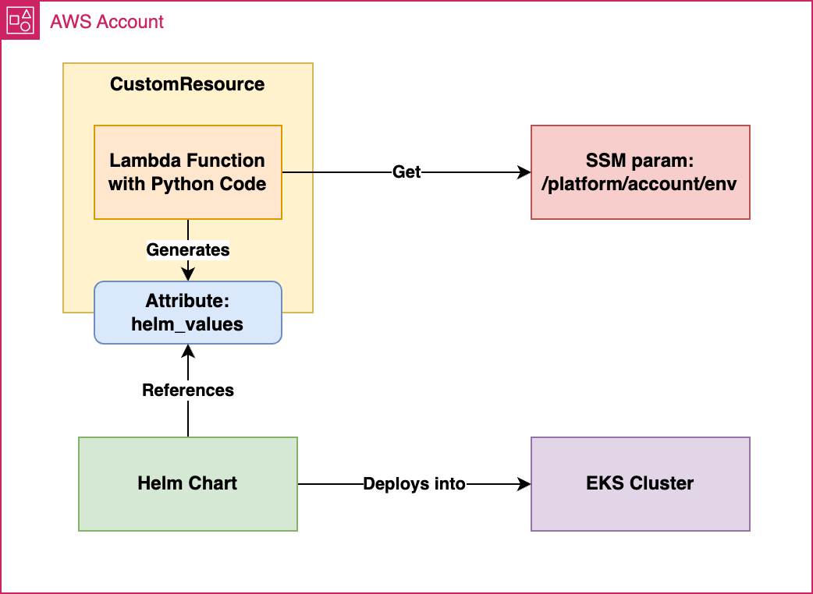

[](https://github.com/fsavoia/cdk-aws-eks/actions/workflows/deploy.yml)

# Welcome to CDK-EKS Python project!

### Overview
This project leverages the AWS Cloud Development Kit (CDK) to deploy an Amazon Elastic Kubernetes Service (EKS) cluster. It includes:

### AWS CDK Stacks:

* `SsmStack`: Manages AWS Systems Manager (SSM) parameters.
* `CustomResourceStack`: Deploys a Lambda function to handle custom resources.
* `EksClusterStack`: Provisions the EKS cluster and deploys the NGINX Ingress Controller using Helm charts.

#### Makefile

Simplifies common development tasks such as testing, cleaning build artifacts, installing dependencies, and managing AWS CDK deployments.

### Architecture



### CICD Pipeline

This repository features a GitHub Actions workflow that automates the deployment of our AWS CDK application, encompassing steps such as repository checkout, environment setup, dependency installation, testing, and deployment. To activate the deployment step, uncomment the relevant section in the workflow file and ensure your AWS credentials and region are securely stored as secrets in your GitHub repository settings. For detailed guidance, refer to resources like [AWS CDK GitHub Actions](https://github.com/marketplace/actions/aws-cdk-github-actions).

### Setup

To manually create a virtualenv on MacOS and Linux:

```
$ python3 -m venv .venv
```

After the init process completes and the virtualenv is created, you can use the following
step to activate your virtualenv.

```
$ source .venv/bin/activate
```

If you are a Windows platform, you would activate the virtualenv like this:

```
% .venv\Scripts\activate.bat
```

Once the virtualenv is activated, you can install the required dependencies.

```
$ make install
```

### Prerequisites

Ensure the following are installed:

* Python 3.12
* AWS CLI
* AWS CDK

### Testing

To run the test suite:
 
```
$ make test
```

### Deployment

Before deploying, ensure your AWS credentials are configured. Then, deploy the stacks:

If not set on CDK settings, the default region will be **us-east-1**.

For CDK AWS account is possible to set like this:

```
$ export CDK_DEFAULT_ACCOUNT=151515151515
```

```
$ make bootstrap
$ make deploy
```

To destroy the deployed stacks:

```
$ make destroy
```

### Configuration

The project uses `cdk.context.json` for configuration:

* **region**: AWS region for deployment (default: us-east-1).
* **project**: Project name identifier.
* **vpc_cidr**: CIDR block for the VPC.
* **dev, staging, prod**: Environment specific configurations.
